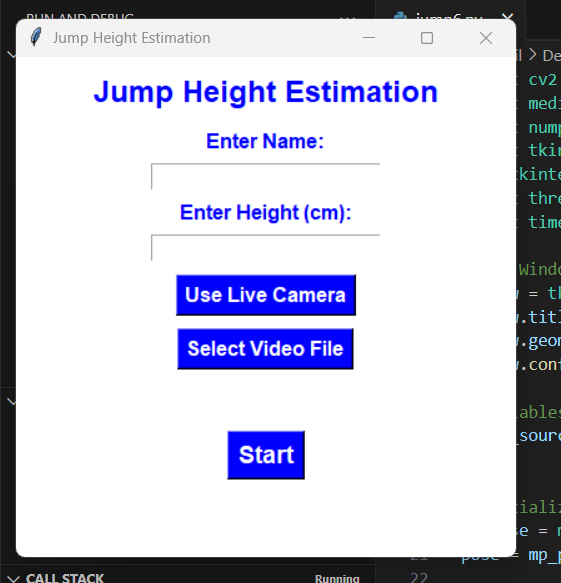

#  Jump Height Estimation using MediaPipe and OpenCV


---

## Description

This project estimates the **jump height of a person** using **MediaPipe Pose detection** and **OpenCV** through a **simple Tkinter-based GUI**.  
Users can either select a **live camera feed** or **upload a video file** for real-time jump height estimation based on body keypoints.

---

##  Features

-  Select **Live Camera** or **Video File** input.
-  Enter **Name** and **Height** to personalize results.
-  **3-second Countdown** before starting.
-  **Real-Time Jump Height Calculation** in centimeters.
-  Displays **Max, Min, Average Jump Heights** dynamically.
-  User-friendly **Tkinter GUI** interface.
-  Smooth performance using **Threading** to avoid freezing.
  

---

##  How It Works

1. **Capture Video** ➔
2. **Detect Pose Landmarks** ➔
3. **Find Hip Midpoint Movement** ➔
4. **Calculate Jump Height** based on entered real-world height ➔
5. **Display Stats Live**

 

---

##  Installation

1. **Clone the Repository**
   ```bash
   git clone https://github.com/Akhillenin0101/Jump-Height-Estimation.git
   cd jump-height-estimation
   pip install -r requirements.txt
   python app.py

<video width="600" controls>
  <source src="working_video.mp4" type="video/mp4">
  Your browser does not support the video tag.
</video>
